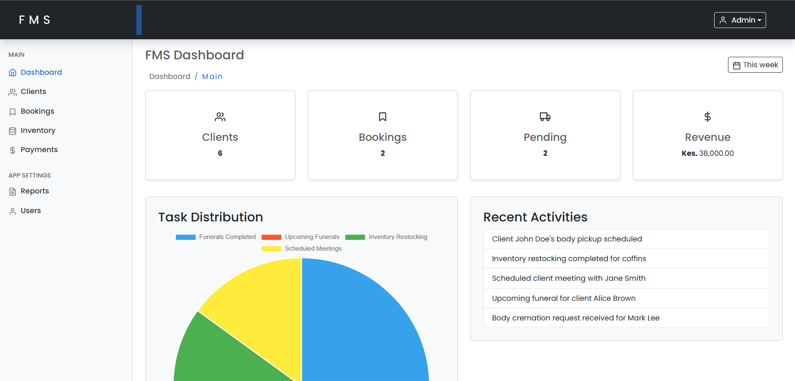
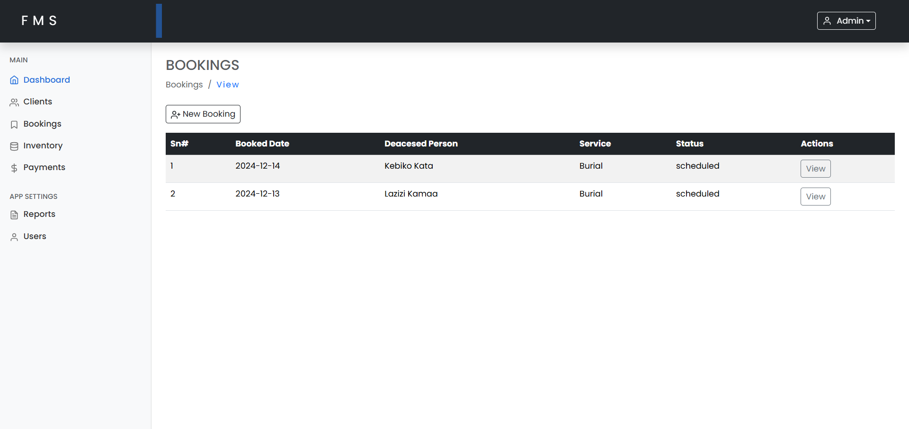
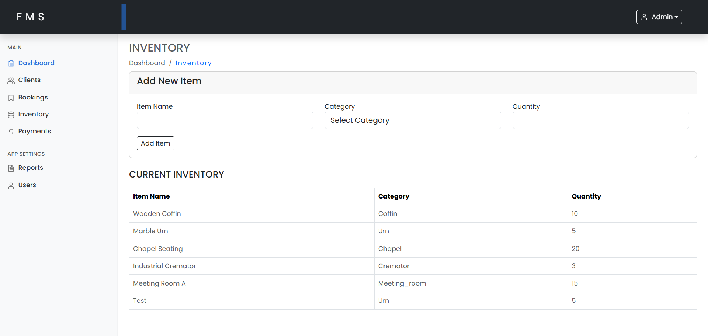
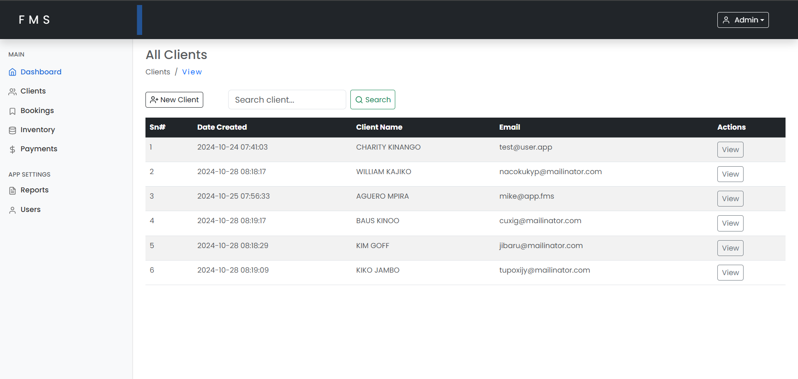
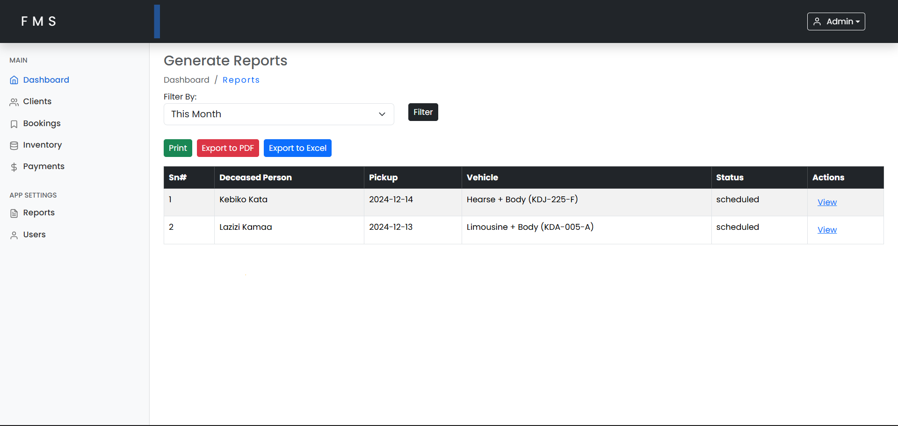
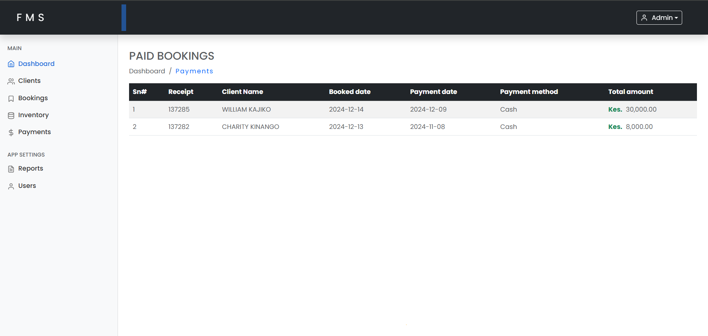
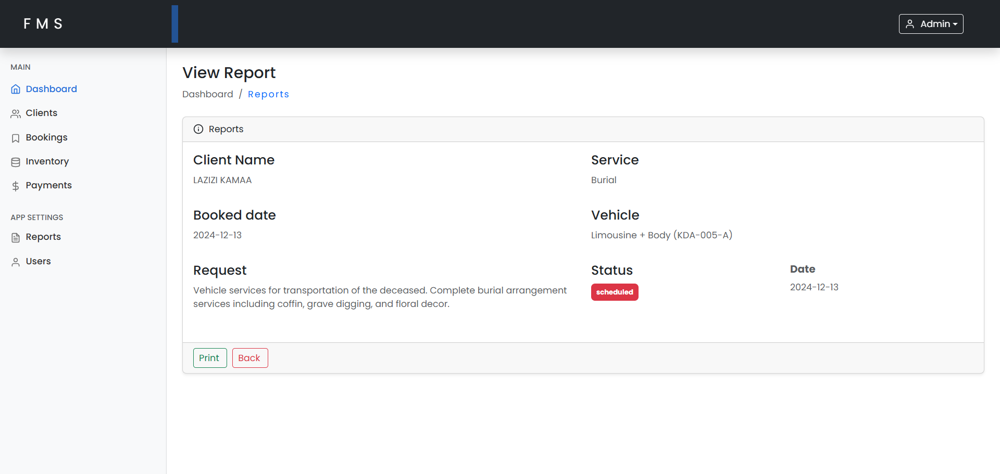

# Funeral Management System (FMS)

### Overview
The **Funeral Management System (FMS)** is a web-based platform designed to streamline operations for funeral service providers. It helps manage logistics, inventory, scheduling, payments, client information, and user accounts efficiently.

---

## Features

- Logistics Management
- Inventory Management
- Scheduling and Records
- Financial Management
- Client Information
- User Accounts

---

## Screenshots

### 1. Dashboard

### 2. Bookings

### 3. Inventory Management

### 4. Clients

### 5. Reports

### 6. Payments

### 7. Client Report

---

## Technologies Used

### Frontend
- **HTML5**: Structure
- **CSS3**: Styling
- **Bootstrap**: Responsive design and UI components

### Backend
- **PHP**: Server-side scripting
- **MySQL**: Database management

---

## Database Structure
| Table Name         | Description                                     |
|--------------------|-------------------------------------------------|
| `users`            | User credentials and roles (admin, staff).      |
| `clients`          | Family representative information.              |
| `deceased`         | Details of deceased individuals.                |
| `logistics`        | Tracks transportation details.                  |
| `inventory`        | Stock management (coffins, urns, etc.).         |
| `schedules`        | Funeral and cremation scheduling.               |
| `payments`         | Payment and financial transaction records.      |
| `Services`         | All services avialable in FMS                   |
| `bookings`         | Stores generated reports.                       |

---

## Installation and Setup

### Prerequisites
- **XAMPP** or any PHP and MySQL-compatible server.
- A browser to access the web interface.

### Steps
1. Clone or download the repository.
2. Place the project folder in your web server's root directory (e.g., `htdocs` for XAMPP).
3. Import the provided `fms.sql` file into your MySQL database.
4. Update the database configuration in `config.php`.
5. Access the application via your browser (`http://localhost/fms`).

---